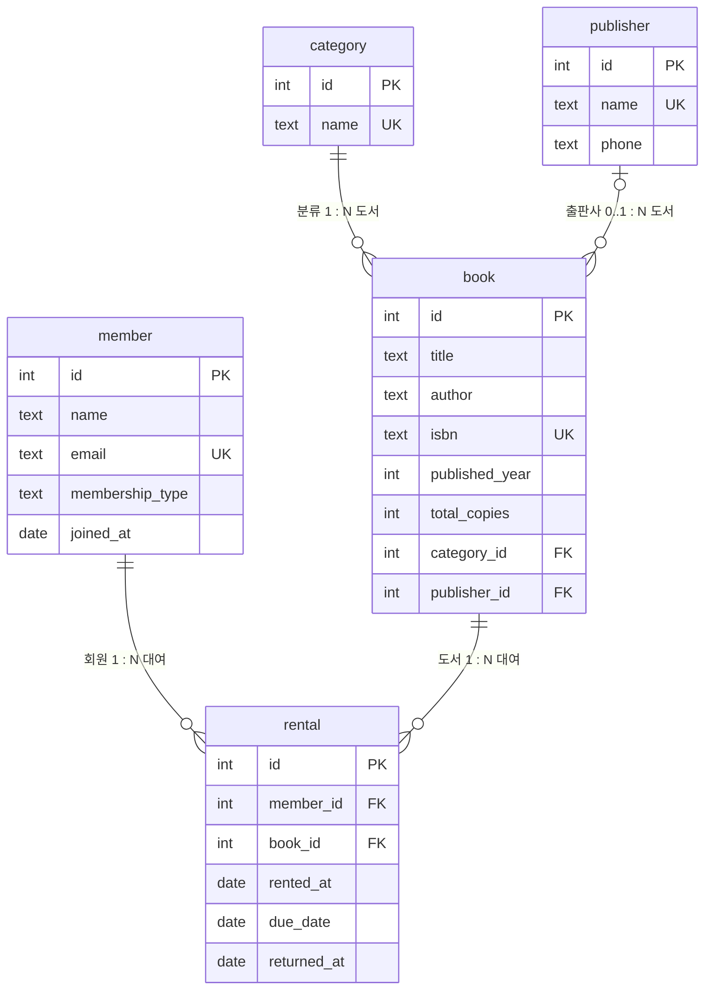

# b5-1 · 도서 관리 데이터베이스 (SQL 실습)

백엔드 프레임워크 없이 **순수 SQL**로 도메인 테이블을 설계하고(PK/FK/제약조건),
샘플 데이터를 넣고(INSERT), 요구사항을 쿼리로 해결(SELECT/JOIN/GROUP BY/서브쿼리)하는
전체 흐름을 담은 실습 결과물이다.

- **DB**: SQLite 3 (파일 기반, 별도 서버 불필요)
- **주제**: 도서 관리 (회원이 도서를 대여하는 도서관)
- **테이블 5개 · 1:N 관계 4개**

## 파일 구성

| 파일 | 설명 |
| --- | --- |
| `schema.sql` | 스키마 생성 (CREATE TABLE, PK/FK/제약조건) |
| `data.sql` | 샘플 데이터 (각 테이블 10행 이상) |
| `queries.sql` | 핵심 쿼리 20개 (기본/조인/집계/서브쿼리/수정·삭제/인덱스) |
| `run.sh` | 위 3개를 순서대로 실행하고 결과를 캡처 |
| `results/results.txt` | `queries.sql` 전체 실행 결과(쿼리 + 결과 표) |
| `results/fk-violation.txt` | FK 위반 시도가 차단되는 결과 (보너스) |

## 실행 방법

```bash
./run.sh
# 또는 수동으로:
sqlite3 library.db < schema.sql
sqlite3 library.db < data.sql
sqlite3 library.db < queries.sql
```

> `library.db`는 스크립트로 매번 재생성되는 산출물이라 저장소에는 커밋하지 않는다(`.gitignore`).

## ERD (관계도)



`rental`이 `member`와 `book` 두 부모를 동시에 참조하며, 이 하나의 테이블이
**"누가(member) 어떤 책을(book) 언제 빌렸나"** 라는 관계를 표현한다.

## 스키마 설계 요점

- **PK**: 모든 테이블에 `id INTEGER PRIMARY KEY AUTOINCREMENT` (행을 유일하게 식별)
- **FK 4개**: `book.category_id`, `book.publisher_id`, `rental.member_id`, `rental.book_id`
  → 없는 값을 참조하면 입력이 막힌다(`results/fk-violation.txt`에서 확인).
- **제약조건**
  - `NOT NULL`: `member.name`, `member.email`, `book.title`, `rental.rented_at` 등
  - `UNIQUE`: `member.email`, `book.isbn`, `category.name`, `publisher.name`
  - `CHECK`: `membership_type IN ('BASIC','PREMIUM')`, `total_copies >= 0`
- **[SQLite 전용]** FK 강제를 위해 `PRAGMA foreign_keys = ON` 필요(기본 OFF).
  날짜는 `date('now')`, `julianday()` 함수를 사용(해당 쿼리에 주석 표기).

## 쿼리 15개+ 요약 (총 20개)

| # | 범주 | 무엇을 확인하는가 |
| --- | --- | --- |
| Q01 | 기본(WHERE·ORDER BY) | 2018년 이후 출간 도서, 최신순 |
| Q02 | 기본(ORDER BY·LIMIT) | 보유 권수 적은 도서 TOP 5 |
| Q03 | 기본(WHERE IS NULL) | 대여 중(미반납) 기록 |
| Q04 | 기본(WHERE·ORDER BY) | PREMIUM 회원, 가입 순 |
| Q05 | INNER JOIN | 대여 중 도서: 회원명 + 도서제목 |
| Q06 | INNER JOIN(3테이블) | 도서 + 분류명 + 출판사명 |
| Q07 | INNER JOIN | 연체 목록 + 연체일수 |
| Q08 | LEFT JOIN + 집계 | 분류별 도서 수(0권 분류 포함) |
| Q09 | LEFT JOIN | 대여 없는 회원(IS NULL 방식) |
| Q10 | 집계(COUNT) | 회원별 대여 횟수 |
| Q11 | 집계(COUNT·랭킹) | 인기 도서 TOP 5 |
| Q12 | 집계(SUM) | 출판사별 보유 권수 합계 |
| Q13 | 집계(AVG) | 분류별 평균 출간연도 |
| Q14 | 서브쿼리(NOT IN) | 한 번도 대여 안 된 도서 |
| Q15 | 서브쿼리(중첩·HAVING) | 평균보다 많이 빌린 단골 회원 |
| Q16 | 서브쿼리(NOT IN) | 대여 없는 회원(서브쿼리 방식) |
| Q17 | UPDATE | 연체 대여를 반납 처리 |
| Q18 | UPDATE | 인기 도서 재입고(+2권) |
| Q19 | DELETE | 오래된 반납 기록 정리 |
| Q20 | INDEX ×2 | `rental(member_id)`, `rental(book_id)` |

## 학습 목표 정리 (스스로 설명하기)

- **엑셀 vs DB**: 엑셀은 시트 하나에 값을 모아둘 뿐, 시트 사이의 *관계*를 강제하지
  못한다. DB는 테이블을 나누고 FK로 연결해 **"없는 회원이 책을 빌리는"** 같은 잘못된
  데이터를 애초에 막고, 원하는 관점으로 다시 조합(JOIN)해 꺼낼 수 있다.
- **PK/FK와 1:N**: PK는 각 행의 고유 번호, FK는 다른 테이블의 PK를 가리키는 "연결 끈".
  `rental.member_id → member.id`처럼 한 회원(1)이 여러 대여(N)를 가지는 게 1:N이다.
- **SELECT/INSERT/UPDATE/DELETE**: 각각 조회 / 추가 / 수정 / 삭제. 예) 대여하면 INSERT,
  반납하면 `returned_at`을 UPDATE, 조회는 SELECT, 오래된 기록 정리는 DELETE.
- **JOIN·GROUP BY**: JOIN은 FK로 나뉜 테이블을 다시 이어 붙이고, GROUP BY는 이어 붙인
  데이터를 기준별로 묶어 COUNT/SUM/AVG로 집계한다(회원별 대여 횟수 등).
- **검색/정렬/집계/랭킹**: WHERE(검색) · ORDER BY(정렬) · GROUP BY+집계 · ORDER BY
  ... LIMIT(랭킹)으로 실무 요구를 SQL 한 문장으로 해결한다.
- **인덱스**: 자주 조회·조인·집계에 쓰이는 컬럼(여기선 `rental.member_id`,
  `rental.book_id`)에 인덱스를 걸면 전체 스캔 대신 빠른 탐색이 된다. 조회 성능은
  좋아지지만 쓰기 시 유지 비용이 늘어 무분별한 인덱스는 피한다.

## 보너스 과제

1. **같은 요구를 JOIN vs 서브쿼리로**: "대여 없는 회원"을 `Q09`(LEFT JOIN + IS NULL)와
   `Q16`(NOT IN 서브쿼리)으로 각각 풀었다. 결과는 동일(오서연, 신건우)하며, LEFT JOIN은
   대량 데이터에서, 서브쿼리는 가독성 면에서 강점이 있다.
2. **FK 정합성 깨뜨리기**: 존재하지 않는 `member_id=999`로 대여를 시도하면
   `FOREIGN KEY constraint failed`로 막힌다(`results/fk-violation.txt`).
   → 부모(member)에 먼저 데이터를 넣은 뒤 대여를 입력해야 한다.
3. **미니 리포트 · 핵심 지표 3개**
   - 인기 도서 TOP (`Q11`) — 어떤 책을 더 들여올지 판단
   - 연체 현황 + 연체일수 (`Q07`) — 독촉 대상 회원 파악
   - 단골 회원 (`Q15`) — 평균 이상 이용 회원 관리
